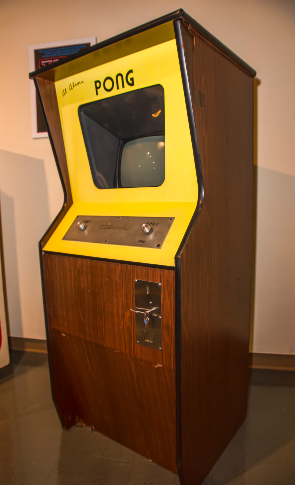

# Pong Game



A classic two-player Pong game implemented in Python using the Turtle graphics library. Players control paddles to hit the ball back and forth, scoring points when the opponent misses. The game features smooth paddle movements, ball bouncing, and a simple yet effective scoring system.

## How to Play

- **Player Controls:**
  - Right Paddle: Up Arrow (Up), Down Arrow (Down)
  - Left Paddle: W (Up), S (Down)

- **Gameplay:**
  - Use the controls to move your paddle up and down.
  - Hit the ball with your paddle to prevent it from passing you.
  - Score points when your opponent misses the ball.

- **Scoring:**
  - Left Player (W/S) scores on the right side.
  - Right Player (Up/Down) scores on the left side.

## Getting Started

1. Clone the repository:

   ```bash
   git clone https://github.com/ganesh42shrma/pong-game-py.git
   cd pong-game
   ```

2. Run the game:

   ```bash
   python main.py
   ```

## Customization

Feel free to customize the game to your liking:

- Adjust paddle speed, ball speed, or colors in `main.py`.
- Modify the appearance of paddles, ball, or scoreboard in their respective files (`paddle.py`, `ball.py`, `scoreboard.py`).

## Contributions

Contributions are welcome! If you have ideas for improvements or new features, feel free to open an issue or submit a pull request.

## License

This project is licensed under the [MIT License](LICENSE).

---
